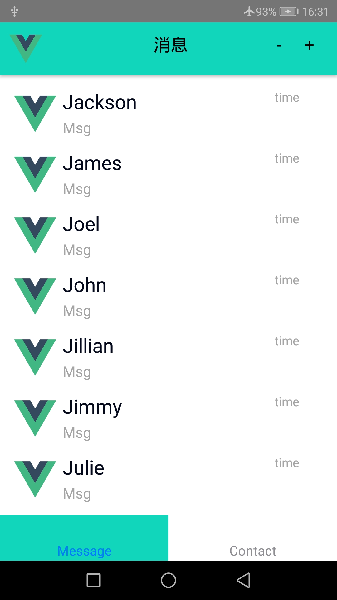
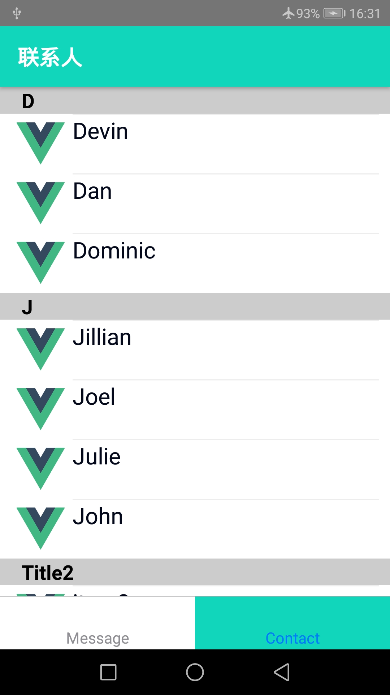
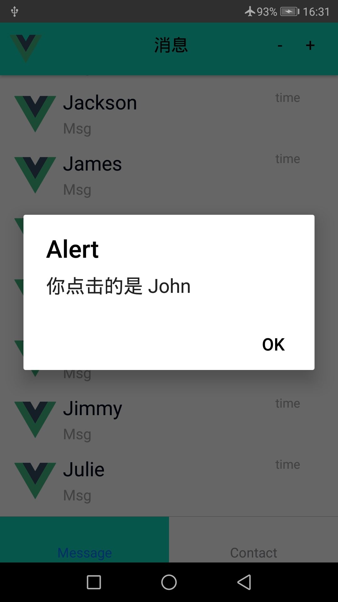

# react-native

## demo1:

## 环境配置
* 具体不说了, 正常安装那里出问题搜索相关资料就行. 

1. `npm install -g react-native-cli`
2. `react-native init ProjectName`
   * `react-native init ProjectName --version X.XX.X`
   * `react-native init ProjectName --version react-native@next`
3. `react-native run-ios` or `react-native run-android`

## api
* 转/demo/api

## components